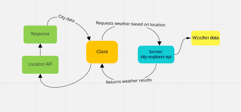
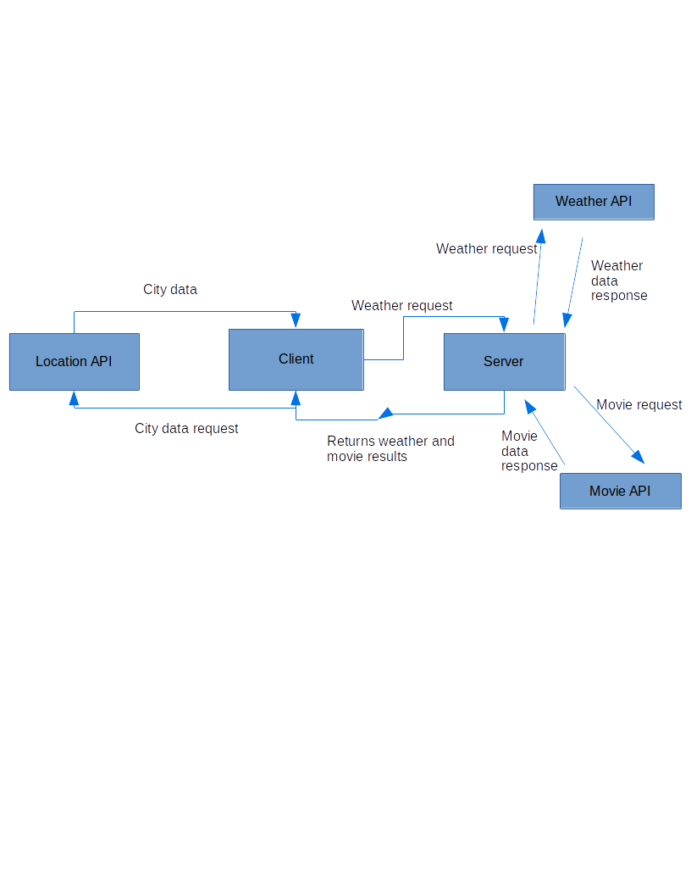
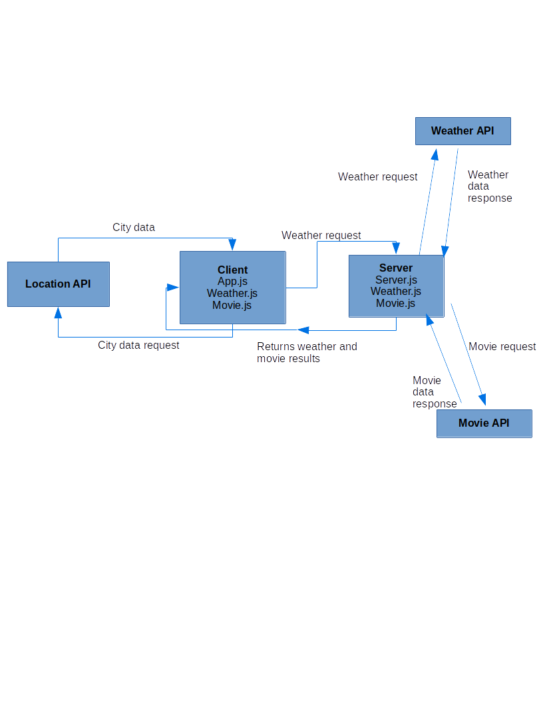
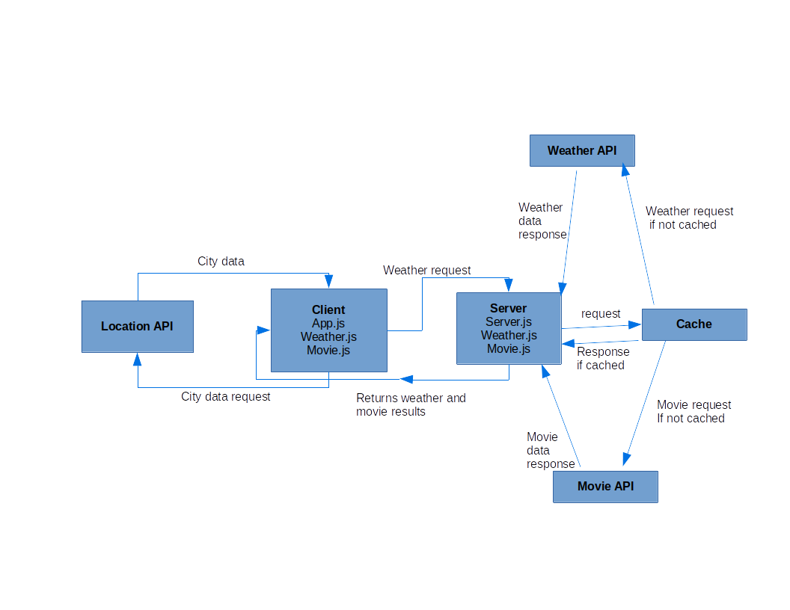

# City Explorer api

**Author**: Dennis DeVries
**Version**: 1.0.0

## Overview

This project creates a custom API server which will provide weather data to our City Explorer front-end application

## Getting Started
<!-- What are the steps that a user must take in order to build this app on their own machine and get it running? -->

## Architecture
<!-- Provide a detailed description of the application design. What technologies (languages, libraries, etc) you're using, and any other relevant design information. -->

## Change Log
<!-- Use this area to document the iterative changes made to your application as each feature is successfully implemented. Use time stamps. Here's an example:

01-01-2001 4:59pm - Application now has a fully-functional express server, with a GET route for the location resource. -->

## Credit and Collaborations

Elizabeth Beale: Framework and dataflow
